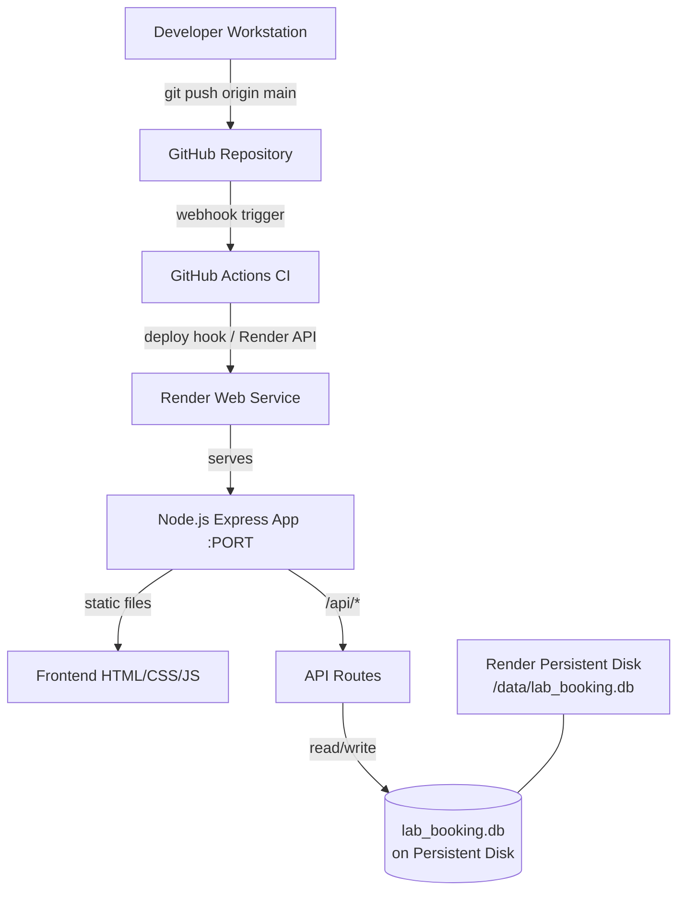
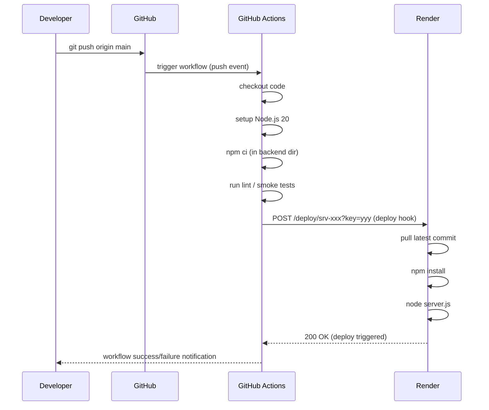
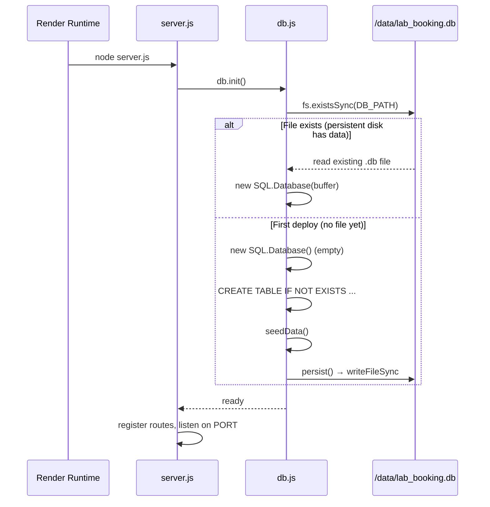

# Design Document: GitHub Deployment

## Overview

Deploy the Lab Booking System (Node.js/Express + sql.js SQLite backend serving a static HTML frontend) to a free-tier cloud platform via GitHub, with a GitHub Actions CI/CD pipeline that automatically deploys on push to `main`. The primary deployment target is **Render** (free tier, supports Node.js, persistent disk add-on available), with the deployment rooted at `lab-booking-system/backend/` since that is the self-contained deployable unit.

The key architectural challenge is that `sql.js` loads the entire SQLite database into memory and writes it back to disk on every mutation. On ephemeral hosting (where the filesystem resets on each deploy/restart), all data is lost. The design addresses this with a **Render Persistent Disk** mount, which survives restarts and redeploys.

---

## Architecture



### Deployment Root

The deployable unit is `lab-booking-system/backend/`. Render is configured with:
- **Root Directory**: `lab-booking-system/backend`
- **Build Command**: `npm install`
- **Start Command**: `node server.js`

The frontend lives at `../frontend` relative to the backend, which maps to `lab-booking-system/frontend/`. Express serves it via `express.static(path.join(__dirname, '../frontend'))`. This path remains valid on Render since the full repo is cloned.

---

## Sequence Diagrams

### CI/CD Pipeline Flow



### App Startup & DB Init



---

## Components and Interfaces

### Component 1: GitHub Repository

**Purpose**: Single source of truth; hosts code and triggers CI/CD.

**Structure**:
```
lab-booking-system/
├── backend/           ← Render root directory
│   ├── server.js
│   ├── db.js
│   ├── routes/
│   ├── package.json
│   └── .gitignore     (excludes node_modules, *.db, .env)
├── frontend/
│   ├── index.html
│   ├── student.html
│   ├── faculty.html
│   ├── admin.html
│   └── style.css
└── .github/
    └── workflows/
        └── deploy.yml ← CI/CD pipeline
```

**Required additions**:
- `lab-booking-system/backend/render.yaml` — Render service definition (IaC)
- `.github/workflows/deploy.yml` — GitHub Actions workflow

### Component 2: GitHub Actions Workflow

**Purpose**: Validate code on every push and trigger Render deployment on `main`.

**Interface** (`.github/workflows/deploy.yml`):
```yaml
on:
  push:
    branches: [main]
    paths: ['lab-booking-system/**']

jobs:
  deploy:
    steps:
      - checkout
      - setup-node@v4 (node 20)
      - npm ci (working-dir: lab-booking-system/backend)
      - curl Render deploy hook (secret: RENDER_DEPLOY_HOOK_URL)
```

**Secrets required** (set in GitHub repo Settings → Secrets):
- `RENDER_DEPLOY_HOOK_URL` — Render-provided deploy hook URL

### Component 3: Render Web Service

**Purpose**: Hosts the Node.js app with a persistent disk for the SQLite file.

**render.yaml interface**:
```yaml
services:
  - type: web
    name: lab-booking-system
    runtime: node
    rootDir: lab-booking-system/backend
    buildCommand: npm install
    startCommand: node server.js
    envVars:
      - key: NODE_ENV
        value: production
      - key: JWT_SECRET
        generateValue: true   # Render auto-generates a secure value
    disk:
      name: lab-db
      mountPath: /data
      sizeGB: 1
```

**Responsibilities**:
- Serve the Express app on the `PORT` Render injects
- Mount persistent disk at `/data` so `lab_booking.db` survives restarts
- Provide `JWT_SECRET` as an environment variable (never hardcoded)

### Component 4: Database Path Configuration

**Purpose**: Make `db.js` use the persistent disk path in production.

**Current** (`db.js`):
```javascript
const DB_PATH = path.join(__dirname, 'lab_booking.db');
```

**Required change**:
```javascript
const DB_PATH = process.env.DB_PATH || path.join(__dirname, 'lab_booking.db');
```

Set `DB_PATH=/data/lab_booking.db` as an env var on Render. This keeps local dev unchanged (no env var set → uses local path) while production writes to the persistent disk.

---

## Data Models

### Environment Variables

| Variable | Required | Source | Description |
|---|---|---|---|
| `PORT` | Yes | Render (auto-injected) | HTTP listen port |
| `JWT_SECRET` | Yes | Render env var | JWT signing secret |
| `DB_PATH` | Yes (prod) | Render env var | Path to SQLite file on persistent disk |
| `NODE_ENV` | Recommended | Render env var | Set to `production` |

### Render Service Definition (`render.yaml`)

```yaml
services:
  - type: web
    name: lab-booking-system
    runtime: node
    rootDir: lab-booking-system/backend
    buildCommand: npm install
    startCommand: node server.js
    envVars:
      - key: NODE_ENV
        value: production
      - key: JWT_SECRET
        generateValue: true
      - key: DB_PATH
        value: /data/lab_booking.db
    disk:
      name: lab-db
      mountPath: /data
      sizeGB: 1
```

---

## Error Handling

### Scenario 1: Persistent Disk Not Mounted / DB_PATH Unreachable

**Condition**: `/data` directory doesn't exist (e.g., disk not attached, wrong mount path).  
**Response**: `db.init()` throws on `fs.writeFileSync` → `server.js` catches and calls `process.exit(1)`.  
**Recovery**: Render restarts the service; operator must verify disk is attached and `DB_PATH` is correct.

### Scenario 2: Deploy Hook Fails in CI

**Condition**: `curl` to Render deploy hook returns non-2xx (invalid URL, Render outage).  
**Response**: GitHub Actions step fails, workflow marked failed, no deployment occurs.  
**Recovery**: Re-run the workflow manually from GitHub Actions UI, or push a new commit.

### Scenario 3: JWT_SECRET Not Set

**Condition**: `JWT_SECRET` env var missing; `auth.js` falls back to hardcoded `'lab_secret_key_2024'`.  
**Response**: App runs but tokens are signed with a weak, public secret — security risk.  
**Recovery**: Set `JWT_SECRET` in Render environment variables. The `render.yaml` `generateValue: true` handles this automatically on first deploy.

### Scenario 4: Build Fails (Missing Dependencies)

**Condition**: `npm install` fails (network issue, bad `package.json`).  
**Response**: Render marks deploy as failed; previous version keeps serving.  
**Recovery**: Fix `package.json`, push again.

---

## Testing Strategy

### Unit Testing Approach

No existing test suite. The CI pipeline should at minimum verify the app starts without crashing:

```bash
# Smoke test: start server, check it responds, kill it
node server.js &
sleep 3
curl -f http://localhost:3000/ && kill %1
```

This can be added as a CI step before the deploy hook call.

### Property-Based Testing Approach

Not applicable for the deployment pipeline itself. For the app's API routes, `fast-check` could be used to generate arbitrary booking/equipment payloads and assert the API never returns 500.

**Property Test Library**: fast-check (if added in future)

### Integration Testing Approach

Post-deploy smoke test via GitHub Actions after deployment:
- Poll the Render service URL until it responds (up to 2 minutes)
- Assert `GET /` returns 200
- Assert `POST /api/auth/login` with valid credentials returns a JWT

---

## Performance Considerations

- **sql.js memory usage**: The entire DB is loaded into memory. For a lab booking system with hundreds of users and bookings, this is fine. At scale (10k+ rows), consider migrating to a proper PostgreSQL instance (Render offers a free PostgreSQL tier).
- **`persist()` on every write**: Every INSERT/UPDATE writes the full DB file to disk. This is acceptable for low-concurrency usage but becomes a bottleneck under high write load.
- **Free tier cold starts**: Render free tier spins down after 15 minutes of inactivity. First request after sleep takes ~30 seconds. Acceptable for a lab booking system; upgrade to paid tier if needed.

---

## Security Considerations

- **JWT_SECRET**: Must be set as a secret env var, never committed to the repo. `render.yaml` uses `generateValue: true` so Render generates a cryptographically random value on first deploy.
- **`.db` file in `.gitignore`**: Already excluded — `lab_booking.db` and `*.db` are in `.gitignore`. The database file must never be committed.
- **`.env` in `.gitignore`**: Already excluded. Local `.env` files must not be committed.
- **CORS**: Currently `app.use(cors())` allows all origins. In production, restrict to the Render service URL:
  ```javascript
  app.use(cors({ origin: process.env.ALLOWED_ORIGIN || '*' }));
  ```
- **Admin email hardcoded**: `auth.js` checks `user.email !== 'sprevanthreddy@gmail.com'` for admin access. This is a hardcoded PII value — consider moving to an env var (`ADMIN_EMAIL`).
- **HTTPS**: Render provides HTTPS automatically via its reverse proxy. No additional TLS config needed.
- **Deploy hook URL**: Treat as a secret. Store in GitHub Secrets as `RENDER_DEPLOY_HOOK_URL`, never in code.

---

## Dependencies

| Dependency | Purpose | Notes |
|---|---|---|
| Render (free tier) | Hosting platform | Persistent disk add-on required for SQLite |
| GitHub Actions | CI/CD runner | Free for public repos; 2000 min/month for private |
| `curl` | Deploy hook trigger in CI | Available in `ubuntu-latest` runner |
| Node.js 20 LTS | Runtime | Specified in CI and Render config |
